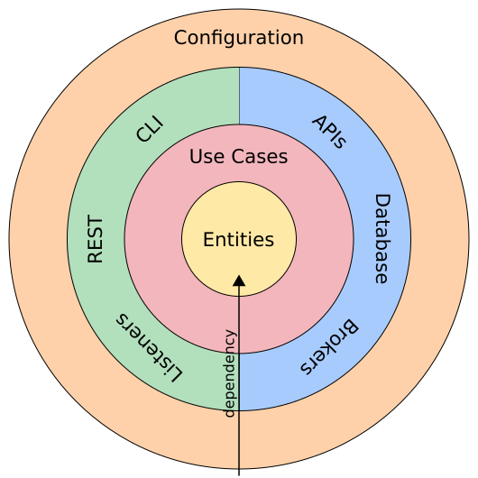

# Central Queue

Generic queue management system

## Design



## References

- [Robert C. Martin - Clean Architecture](https://www.youtube.com/watch?v=Nltqi7ODZTM)
- [Real Life Clean Architecture](https://www.slideshare.net/mattiabattiston/real-life-clean-architecture-61242830)
  - [Clean Architecture Example (Java): Example of what clean architecture would look like](https://github.com/mattia-battiston/clean-architecture-example)
- [A example of clean architecture in Java 8 and Spring Boot 2.0](https://github.com/eliostvs/clean-architecture-delivery-example)

## Usage

### Build

```console
$ ./mvnw clean install [-Dspring.profiles.active=dev]
```

### Run

```console
$ ./mvnw spring-boot:run -pl app
```

#### API Tests

While running:

```console
$ ./mvnw test -pl app -Dtest=KarateRunner [-DargLine="-Dapp.server.baseUrl=http://localhost:8080"]
```
