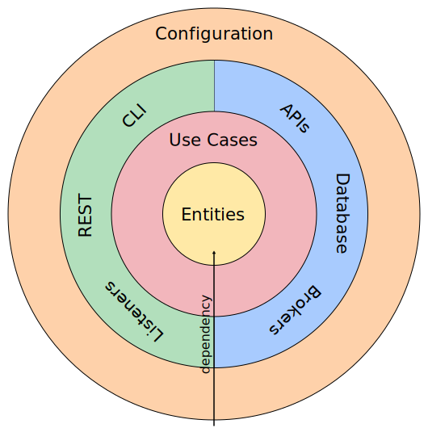

# Central Queue

Generic queue management system

## Design

### Clean Architecture



- **Core**: Business Logic
  - **Entities**
    - Represent your domain object
    - Apply only logic that is applicable in general to the whole entity (e.g. validating the format of an hostname)
    - Plain java objects: no frameworks, no annotations
  - **Use Cases**
    - Represent your business actions, it’s what you can do with the application. Expect one use case for each business action
    - Pure business logic, plain java (expect maybe some utils libraries like StringUtils)
    - Define interfaces for the data that they need in order to apply some logic. One or more dataproviders will implement the interface, but the use case doesn’t know where the data is coming from
    - The use case doesn't know who triggered it and how the results are going to be presented (e.g. could be on a web page, or returned as json, or simply logged, etc.)
    - Throws business exceptions
- **Dataproviders**: Retrieve and store information
  - Retrieve and store data from and to a number of sources (database, network devices, file system, 3rd parties, etc.)
  - Implement the interfaces defined by the use case
  - Use whatever framework is most appropriate (they are going to be isolated here anyway)
  - Note: if using an ORM for database access, here you'd have another set of objects in order to represent the mapping to the tables (don't use the core entities as they might be very different)
- **Entrypoints**: Access to the application
  - Are ways to interact with the application, and typically involve a delivery mechanism (e.g. REST APIs, scheduled jobs, GUI, other systems)
  - Trigger a use case and convert the result to the appropriate format for the delivery mechanism
  - A GUI would use MVC (or MVP) in here; the controller would trigger a use case
- **Configuration**: Wires everything together
  - Wires everything together
  - Frameworks (e.g. for dependency injection) are isolated here
  - Has the "dirty details" like Main class, web server configuration, datasource configuration, etc.

## References

- [Robert C. Martin - Clean Architecture](https://www.youtube.com/watch?v=Nltqi7ODZTM)
- [Real Life Clean Architecture](https://www.slideshare.net/mattiabattiston/real-life-clean-architecture-61242830)
  - [Clean Architecture Example (Java): Example of what clean architecture would look like](https://github.com/mattia-battiston/clean-architecture-example)
- [A example of clean architecture in Java 8 and Spring Boot 2.0](https://github.com/eliostvs/clean-architecture-delivery-example)

## Usage

### Build

```console
$ ./mvnw clean install [-Dspring.profiles.active=dev]
```

### Run

```console
$ ./mvnw spring-boot:run -pl app
```

#### API Tests

While running:

```console
$ ./mvnw test -pl app -Dtest=KarateRunner [-DargLine="-Dapp.server.baseUrl=http://localhost:8080"]
```
