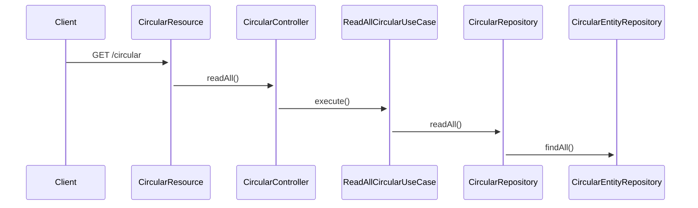

```mermaid
sequenceDiagram
  Client->>+CircularResource: GET /circular
  CircularResource->>+CircularController: readAll()
  CircularController->>+ReadAllCircularUseCase: execute()
  ReadAllCircularUseCase->>+CircularRepository: readAll()
  CircularRepository->>+CircularEntityRepository: findAll()
```