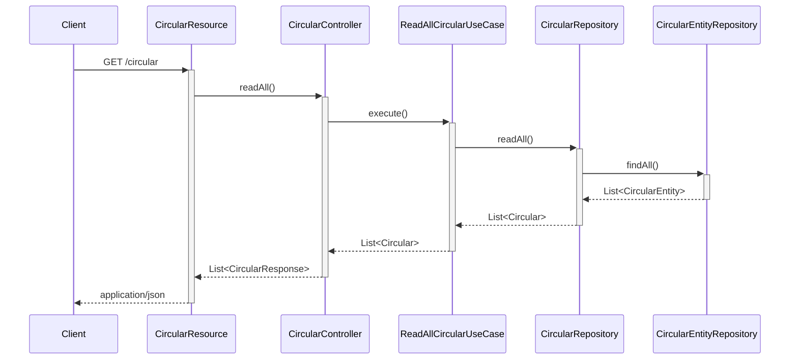

```mermaid
sequenceDiagram
  participant client as Client
  participant resource as CircularResource
  participant controller as CircularController
  participant usecase as ReadAllCircularUseCase
  participant repository as CircularRepository
  participant database as CircularEntityRepository

  client->>+resource: GET /circular
  resource->>+controller: readAll()
  controller->>+usecase: execute()
  usecase->>+repository: readAll()
  repository->>+database: findAll()
  database-->>-repository: List<CircularEntity>
  repository-->>-usecase: List<Circular>
  usecase-->>-controller: List<Circular>
  controller-->>-resource: List<CircularResponse>
  resource-->>-client: application/json
```
