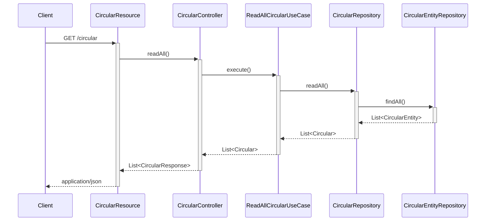

```mermaid
sequenceDiagram
  Client->>+CircularResource: GET /circular
  CircularResource->>+CircularController: readAll()
  CircularController->>+ReadAllCircularUseCase: execute()
  ReadAllCircularUseCase->>+CircularRepository: readAll()
  CircularRepository->>+CircularEntityRepository: findAll()
  CircularEntityRepository-->>-CircularRepository: List<CircularEntity>
  CircularRepository-->>-ReadAllCircularUseCase: List<Circular>
  ReadAllCircularUseCase-->>-CircularController: List<Circular>
  CircularController-->>-CircularResource: List<CircularResponse>
  CircularResource-->>-Client: application/json
```
